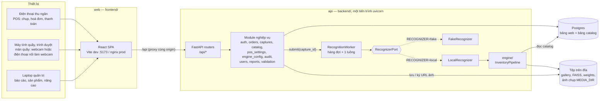
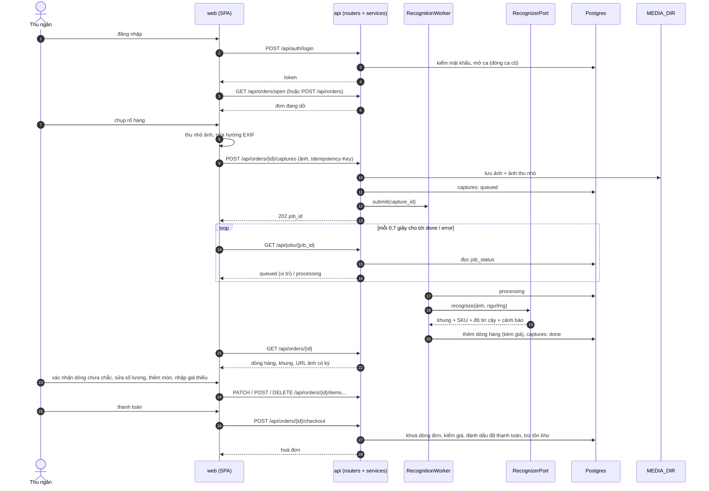

# Kiến trúc hệ thống — Stocktaking AI (full-stack)

> Mô tả đúng code hiện có trên `main` (FastAPI + Postgres + React; bản refactor đã merge). Thuật toán của pipeline nhận diện: [`01_PROJECT_CONTEXT.md`](01_PROJECT_CONTEXT.md), [`02_MODULE_SPECIFICATION.md`](02_MODULE_SPECIFICATION.md). Dữ liệu và catalog: [`04_DATA_AND_CATALOG.md`](04_DATA_AND_CATALOG.md). Cách chạy: [`WEB.md`](WEB.md).

## 1. Sơ đồ tổng thể (HLD)



Ba dịch vụ trong `docker-compose.yml`, cộng một job chạy một lần:

| Dịch vụ | Vai trò | Cổng trên máy |
|---|---|---|
| `postgres` | Postgres 16; volume `pg-data` | 5437 |
| `migrate` | `alembic upgrade head` rồi thoát; `api` chỉ khởi động khi job này thành công | — |
| `api` | FastAPI + bộ nhận diện, **một** worker uvicorn | 8000 |
| `web` | Vite (dev, hot reload) hoặc nginx phục vụ bản build (prod); chuyển tiếp `/api` sang `api` | 5173 |

Trình duyệt chỉ nói chuyện với `web`; API không có CORS vì mọi request đi cùng origin qua proxy.

## 2. Vì sao chỉ một tiến trình API

Model (RF-DETR, SAM2, SigLIP2), hàng đợi nhận diện, bộ đếm đăng nhập sai và khoá idempotency đều nằm trong bộ nhớ của tiến trình `api`. Chạy hai worker sẽ nạp model hai lần và làm các bộ đếm lệch nhau, nên chỉ được chạy một worker: compose và Dockerfile đặt `--workers 1`; `make dev-api` không truyền cờ này và dùng mặc định của uvicorn (cũng là một worker). Không dùng Redis hay hàng đợi ngoài.

Trạng thái lượt chụp thì **không** nằm trong bộ nhớ: nó ở bảng `captures` (`queued` → `processing` → `done` | `error`). Lượt chụp còn dở khi máy chủ khởi động lại được trả về lỗi `SERVER_RESTARTED` để thu ngân chụp lại.

## 3. Backend (`backend/`)

```text
backend/
├── entrypoints/     api.py (app = create_app()), reset_password, seed_demo,
│                    import_legacy_sqlite, purge_media, check_env
├── app/
│   ├── main.py      gốc lắp ghép: chọn database và bộ nhận diện, nối các module
│   ├── core/        config, db, base, backends, deps, errors, logging,
│   │                signed_url, uploads, clock, columns
│   └── modules/     mỗi module một thư mục (bảng dưới)
├── engine/          pipeline nhận diện (thư mục `src/` cũ); CLI `python -m engine`
├── migrations/      Alembic: 0001 bảng web, 0002 bảng catalog, 0003 kích thước ảnh + cảnh báo, 0004 tồn kho
├── configs/         config.yaml (thật), config.demo.yaml (mock, CPU), legacy/
├── scripts/         công cụ của engine + smoke_api.py
├── tests/           test engine (phẳng) + tests/api/ (API trên Postgres thật)
└── data/ · data_demo/ · weights/      tài nguyên chạy, không commit
```

### Module

| Module | Việc | Bảng sở hữu |
|---|---|---|
| `auth` | đăng nhập, token JWT, ca làm việc (một ca mở mỗi tài khoản), giới hạn đăng nhập sai | `users`, `shifts` |
| `users` | quản trị nhân viên | (dùng `users`) |
| `pos_settings` | cài đặt quầy, mật khẩu nâng cao | `settings` |
| `catalog` | tìm sản phẩm, giá, barcode, bằng chứng nhận diện, màu tham chiếu, ảnh gallery | `product_prices` (đọc/ghi bảng catalog của engine) |
| `inventory` | tồn kho: bảng và hai hàm duy nhất đổi số tồn (bán/huỷ đơn, admin nhập số đếm); không có router riêng, số tồn hiện và sửa qua `catalog` | `product_stock` |
| `orders` | đơn, dòng hàng, thanh toán (trừ tồn kho), huỷ (hoàn tồn kho), lịch sử | `orders`, `order_items` |
| `captures` | nhận ảnh, idempotency, trạng thái job, URL ảnh có ký | `captures` |
| `recognition` | `RecognizerPort`, `LocalRecognizer`, `FakeRecognizer`, `RecognitionWorker` | — |
| `engine_config` | thiết lập nâng cao của pipeline: danh mục thông số, áp dụng, nạp lại | `config_overrides` |
| `audit` | nhật ký thay đổi và hoàn tác | `change_log` |
| `reports` | KPI, doanh thu theo ngày, top sản phẩm | — |
| `validation` | chạy benchmark, so baseline, thử bằng chứng | — |

Mỗi module có cùng một bộ file: `models.py` (bảng), `repository.py` (nơi **duy nhất** chạy SQL, SQLAlchemy Core async), `service.py` (luật nghiệp vụ), `schemas.py` (kiểu vào/ra của API), `ports.py` (giao kèo cho module khác), `deps.py`, `router.py`. `app/main.py` dựng từng service và đặt vào `Backends`; router lấy service qua `Depends`.

Lỗi nghiệp vụ là `AppError` và luôn trả `{"detail": "<thông báo tiếng Việt>", "code": "<MÃ>"}`; mã lỗi và HTTP status giữ như web v1.

### Ranh giới với engine

- `engine/` không import `app/` hay FastAPI: nó vẫn chạy độc lập bằng `python -m engine`.
- `app/` chỉ import `engine` **trễ** (bên trong hàm), ở đúng ba chỗ: `recognition/local_pipeline.py` (chạy pipeline), `catalog/` (ghi catalog bằng hàm của engine, chuẩn hoá bằng chứng) và `engine_config/` + `validation/` (đọc/dựng config, chạy benchmark). Với `RECOGNIZER=fake`, API khởi động mà không nạp `engine`, torch, faiss hay OpenCV — `tests/test_import_boundary.py` kiểm điều này.
- Đọc catalog cho màn hình web: `catalog/repository.py` truy vấn thẳng các bảng `product`, `product_evidence`, `color_reference` bằng SQL. Ghi catalog: `CatalogEdits` mở một phiên đồng bộ trong luồng phụ, gọi hàm của `engine.catalog.edits`, ghi `change_log` trên cùng kết nối rồi commit một lần; sau đó bộ nhận diện nạp lại catalog giữa hai lượt chụp.

## 4. Luồng chụp → hoá đơn → thanh toán



Điều kiện từ chối đáng nhớ: hàng đợi đầy → 503 `QUEUE_FULL`; đang chạy kiểm định hoặc đang nạp lại pipeline → `SYSTEM_BUSY`; ảnh quá `MAX_UPLOAD_MB` → 413; nhận diện quá `RECOGNITION_TIMEOUT_SECONDS` → job lỗi. Gửi lại cùng `Idempotency-Key` trên cùng đơn trong `IDEMPOTENCY_WINDOW_SECONDS` trả về job đầu tiên, không nhận diện lần hai.

## 5. Luồng quản trị đụng tới pipeline

| Thao tác | Điều xảy ra |
|---|---|
| Sửa tên, barcode, bằng chứng, màu tham chiếu | ghi bảng catalog + `change_log` trong một giao dịch; bộ nhận diện nạp lại catalog trước lượt chụp kế tiếp |
| Sửa giá, cài đặt quầy | ghi bảng web + `change_log`; hiệu lực ngay |
| Nhập số tồn kho | ghi `product_stock` + `change_log`; để trống = không theo dõi sản phẩm đó. Hoàn tác bị từ chối nếu đã có đơn bán làm số tồn đổi |
| Áp dụng thiết lập nâng cao | cần mật khẩu nâng cao; lưu vào `config_overrides`; dựng lại pipeline trên luồng nhận diện (ngừng nhận diện trong lúc đó); dựng lỗi thì quay về thiết lập cũ |
| Kiểm định | cần mật khẩu nâng cao; chạy benchmark trên luồng nhận diện, lượt chụp bị từ chối trong lúc chạy; kết quả so với `data/baseline/` |
| Hoàn tác | `POST /api/admin/change-log/{id}/revert`; từ chối nếu giá trị đã bị đổi sau đó |

## 6. Dữ liệu

- **Postgres** (schema do Alembic sở hữu, không tạo bảng lúc khởi động):
  - bảng web: `users`, `shifts`, `orders`, `order_items`, `captures`, `product_prices`, `product_stock`, `settings`, `config_overrides`, `change_log`;
  - bảng catalog của engine: `product`, `product_evidence`, `color_reference`, `catalog_meta`.
- **Đĩa** (`backend/`, gắn vào container, không nằm trong image): `data/` hoặc `data_demo/` (gallery, index FAISS trong `cache/`, benchmark, baseline), `weights/` (chỉ đọc), `MEDIA_DIR` (ảnh chụp theo đơn: `<mã đơn>/<file>`).
- **Tồn kho** (`product_stock`): thanh toán trừ số lượng của đơn, huỷ đơn đã thanh toán cộng lại, cùng giao dịch với đơn. Sản phẩm không có dòng trong bảng là không theo dõi. Số tồn được phép âm (bán vượt số đã đếm): không chặn thanh toán, trang Sản phẩm báo "hết hàng" / "bán vượt tồn". Chưa có lịch sử nhập/xuất; khi thêm thì ghi trong `inventory/repository.py`. Số ngẫu nhiên để demo: `make seed-stock`.
- Ảnh chụp và ảnh gallery được trả qua URL có chữ ký HMAC và hạn dùng (`MEDIA_URL_SECRET`, `MEDIA_URL_TTL_SECONDS`), vì thẻ `` không gửi được token.
- Khi web chạy, pipeline đọc catalog từ Postgres (API truyền URL database vào `build_config`). Khi chạy `python -m engine` độc lập, nguồn catalog theo khối `catalog` của file config (SQLite hoặc snapshot).

## 7. Frontend (`frontend/`)

```text
frontend/src/
├── router.tsx       mọi route (TanStack Router, khai báo bằng code) + guard theo token và vai trò
├── lib/             api-client (apiFetch, ApiError), errors, auth-token, query-keys, format, types
├── components/      app-shell, confirm-dialog, route-states, ui/ (button, input, dialog, switch…)
├── features/
│   ├── auth/        đăng nhập
│   ├── pos/         chụp, hoá đơn + khung nhận diện, sửa dòng, thanh toán, hoàn tất, lịch sử, hướng dẫn lần đầu;
│   │                màn quầy cho màn hình rộng (desk-page, desk-camera, use-desk)
│   └── admin-*/     reports, orders, users, settings, products, advanced
└── test/            setup + test-utils (renderApp, stubFetchRoutes)
```

| Đường dẫn | Màn hình | Vai trò |
|---|---|---|
| `/login` | đăng nhập | mọi người |
| `/pos`, `/pos/orders/$orderId`, `…/capture`, `…/pay`, `…/done` | chụp, hoá đơn, chụp thêm, thanh toán, hoàn tất | thu ngân |
| `/history`, `/onboarding` | lịch sử ca, hướng dẫn lần đầu | thu ngân |
| `/admin/…` | báo cáo, đơn hàng, nhân viên, cài đặt, sản phẩm, nâng cao | quản trị |

Từ bề rộng 1024 px (máy tính, tablet xoay ngang), `/pos`, `/pos/orders/$orderId` và `…/capture` hiện **màn quầy**: camera (webcam, hoặc điện thoại nối làm webcam) bên trái, giỏ hàng luôn hiện bên phải, chụp liên tiếp không rời trang; kéo thả ảnh vào khung camera cũng được nhận diện. Phím tắt: Space chụp, F2 thanh toán, F4 thêm món theo tên; ở màn thanh toán gõ số tiền, Enter xác nhận, Esc quay lại; ở màn hoàn tất Enter mở đơn mới. Màn hẹp giữ luồng điện thoại. Camera đã chọn được nhớ trong `localStorage` của máy đó.

Máy chủ là nguồn sự thật: đơn đang dở lấy từ `GET /api/orders/open`, nên tải lại trang không mất đơn. Dữ liệu máy chủ đi qua TanStack Query; trạng thái job được hỏi lại định kỳ bằng `refetchInterval`.

## 8. Điểm khác web v1

| Web v1 (commit `f30710d`) | Hiện tại |
|---|---|
| `http.server` + `sqlite3`, một cổng 8000 phục vụ cả giao diện | FastAPI + Postgres + Alembic; giao diện là dịch vụ riêng |
| HTML/JS thuần | Vite + React + TypeScript |
| trạng thái job trong bộ nhớ | bảng `captures` |
| mật khẩu ban đầu sinh vào `.env` | không có tài khoản mặc định: `make reset-password` |
| `launch.bat`, `scripts/check_env.py`, `db_snapshot.py` | `make docker-up`, `make check-env`, `make db-save` / `db-restore` |
| giao diện desktop Tkinter | bỏ; thay bằng trang quản trị |
